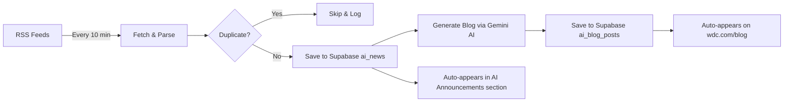

# 🤖 AI News Automation — Setup Guide

## How It Works (End-to-End Pipeline)



---

## Step 1: Create Supabase Tables

1. Go to your [Supabase Dashboard](https://supabase.com/dashboard)
2. Open **SQL Editor** (left sidebar)
3. Copy the entire contents of [supabase_ai_news_schema.sql](file:///c:/Users/Usman/Developersofchicago/supabase_ai_news_schema.sql)
4. Paste and click **Run**

This creates 3 tables:
- `ai_news` — stores RSS feed items
- `ai_blog_posts` — stores AI-generated blog articles
- `automation_logs` — logs every operation

## Step 2: Get Your API Keys (Both FREE)

### Gemini API Key (Free)
1. Go to [aistudio.google.com/apikey](https://aistudio.google.com/apikey)
2. Click **Create API Key**
3. Copy the key

### Supabase Keys (You already have these)
1. Go to your Supabase Dashboard → **Settings** → **API**
2. Copy your **Project URL** and **anon public key**

## Step 3: Create `.env` File

Create a file called `.env` in your project root:

```env
VITE_SUPABASE_URL=https://your-project.supabase.co
VITE_SUPABASE_ANON_KEY=your-anon-key-here
GEMINI_API_KEY=your-gemini-api-key-here
```

> [!CAUTION]
> Never commit your `.env` file to Git! It should already be in `.gitignore`.

## Step 4: Run the Automation

```bash
npm run ai-news
```

You'll see:
```
╔══════════════════════════════════════════════╗
║  🤖 DC AI News Automation                  ║
║  Checking RSS feeds every 10 minutes         ║
║  Press Ctrl+C to stop                        ║
╚══════════════════════════════════════════════╝

[2026-03-12T08:00:00Z] feed_checked: Starting RSS feed check...
[2026-03-12T08:00:02Z] article_saved: Saved: "OpenAI Releases GPT-5..."
[2026-03-12T08:00:05Z] blog_generated: Published blog → /blog/openai-releases-gpt-5
```

## Step 5: Verify

1. Check your website's **"Latest AI Announcements"** section on the homepage
2. Go to `your-site.com/blog` — AI-generated articles will appear alongside Dev.to posts
3. Click any AI article to read the full generated blog post

---

## What Gets Automated

| Component | Source | Frequency |
|---|---|---|
| **AI Announcements** (homepage) | Supabase `ai_news` | Live (latest 5) |
| **Blog posts** (`/blog`) | Dev.to + Supabase `ai_blog_posts` | Live (merged feed) |
| **Announcement Bar** (header) | Dev.to latest | Live |
| **Blog article** (`/blog/:slug`) | Dev.to + Supabase | Automatically generated |

## RSS Sources

The script fetches from these AI news sources:
- 🤖 AI News (artificialintelligence-news.com)
- 💻 TechCrunch AI
- 📰 VentureBeat AI
- 🔍 Google News AI

## n8n Alternative

If you prefer using n8n instead of the local script, you can create a workflow with:

1. **Schedule Trigger** → Every 10 minutes
2. **HTTP Request** → Fetch RSS feed URL
3. **XML Node** → Parse the XML
4. **Code Node** → Extract title, link, excerpt, published date
5. **Supabase Node** → Check for duplicates in `ai_news`
6. **IF Node** → Skip if duplicate
7. **Supabase Node** → Insert into `ai_news`
8. **HTTP Request** → Call Gemini API to generate article
9. **Supabase Node** → Insert into `ai_blog_posts`

> [!TIP]
> The local script (`npm run ai-news`) does all of this in one command with zero n8n setup needed!
